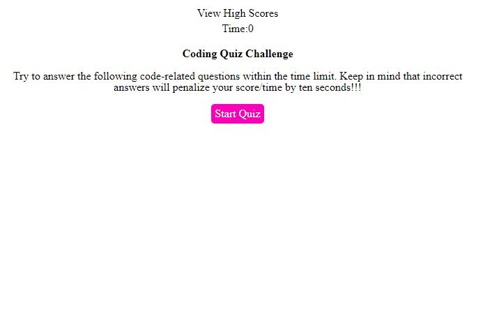

# Week4aQuizz

## Info

```
AS A coding boot camp student
I WANT to take a timed quiz on JavaScript fundamentals that stores high scores
SO THAT I can gauge my progress compared to my peers

```

I have attempted this project to better understand the vast use of JavaScript.

I have a better understanding of the JavaScript grammar however when it comes to the practical part, there is a lot of information to remember, therefore more time and practise is required to master it. 

This project helped sharpening my skills and had fun doing it. 

 - [For a full web description of the Password-NewGen](https://bonda3vaax.github.io/Password-NewGen2/)
 - [For a full github description of the Password-NewGen](https://github.com/Bonda3Vaax/Password-NewGen2)

# Features

```
GIVEN I am taking a code quiz
WHEN I click the start button
THEN a timer starts and I am presented with a question
WHEN I answer a question
THEN I am presented with another question
WHEN I answer a question incorrectly
THEN time is subtracted from the clock
WHEN all questions are answered or the timer reaches 0
THEN the game is over
WHEN the game is over
THEN I can save my initials and my score

```

## Mock-Up

The following image shows the web application's appearance and functionality:



## Requirements 

This project requires:

  - Visual Studio Code
  
  - Chrome Browser

## Installation

Week4aQuizz requires Visual Studio Code and Chrome Browser in this case, to be installed.   

- [Visual Studio Code](https://code.visualstudio.com/Download)

- [Chrome](https://https://www.google.com.au/chrome/?brand=YTUH&gclid=Cj0KCQjwspKUBhCvARIsAB2IYut5nZcv5KdxSPEM-jChArgYIusCGWIY69hokwFpE1uWWRiR1NGNl4gaAmrbEALw_wcB&gclsrc=aw.ds)

## How to use

 - Open Visual Studio, click Explorer, add folder to workspace for code inspection, additional modifications, debugging, and visualization in default browser.
 
 - Open index.html in default browser for visualization and inspection by pressing the F12 key.

## Project Status

To be reviewd by the Centralised Grading Team. 


## Faq

Q: How do I access Week4aQuizz?

A: By copying the following Url into your default Browser, https://bonda3vaax.github.io/Password-NewGen2/, followed by Enter key.

## Author

 - Andrei Bondaret

## Credits

 - [Mdn Web Docs](https://developer.mozilla.org/en-US/)

## Acknowledgements

 - [Visual Studio Code](https://code.visualstudio.com/)
 - [Chrome](https://google.com)